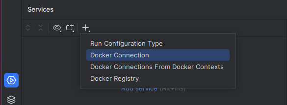
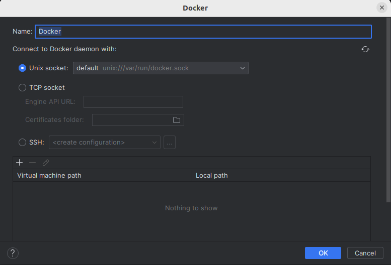
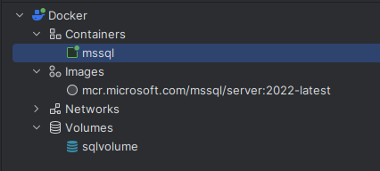
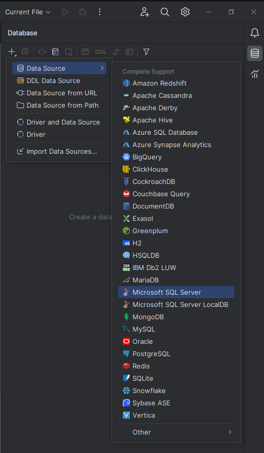
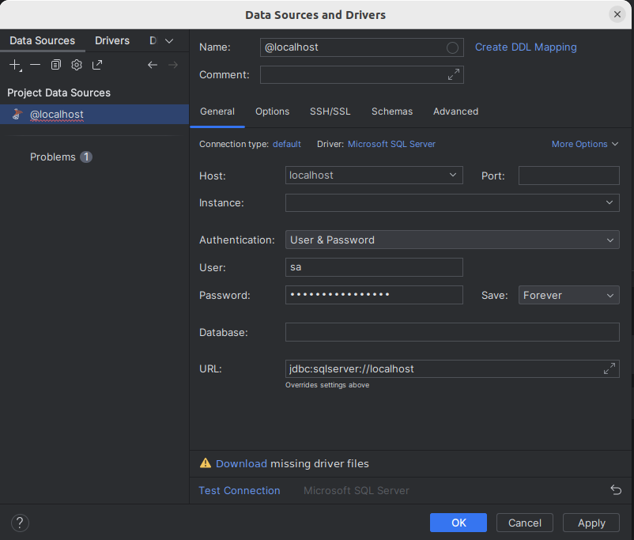
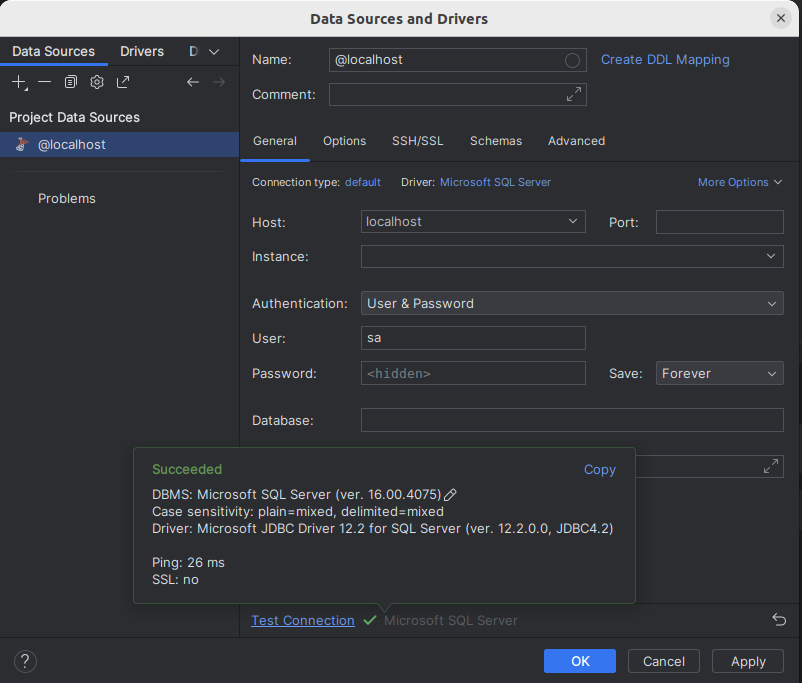

# Sommario
<!-- TOC -->
* [Sommario](#sommario)
* [Installazione Docker su ubuntu 22.04](#installazione-docker-su-ubuntu-2204)
  * [Set up Docker's Apt repository.](#set-up-dockers-apt-repository)
  * [Install the Docker packages.](#install-the-docker-packages)
  * [Manage Docker as a non-root user.](#manage-docker-as-a-non-root-user)
    * [Create the docker group.](#create-the-docker-group)
    * [Add your user to the docker group.](#add-your-user-to-the-docker-group)
    * [Log out and log back in so that your group membership is re-evaluated.](#log-out-and-log-back-in-so-that-your-group-membership-is-re-evaluated)
* [Installazione di un'istanza microsoft sql server di test](#installazione-di-unistanza-microsoft-sql-server-di-test)
  * [Creazione istanza](#creazione-istanza)
  * [Verifica istanza](#verifica-istanza)
  * [Altri comandi docker](#altri-comandi-docker)
* [Configurazione IntelliJ](#configurazione-intellij)
  * [Configurazione servizio docker](#configurazione-servizio-docker)
  * [Configurazione connessione JDBC](#configurazione-connessione-jdbc)
<!-- TOC -->

# Installazione Docker su ubuntu 22.04

Vedi anche:
* [Install Docker Engine on Ubuntu](https://docs.docker.com/engine/install/ubuntu/)
* [Linux post-installation steps for Docker Engine](https://docs.docker.com/engine/install/linux-postinstall/)

## Set up Docker's Apt repository.

```shell
sudo bash << SCRIPT 
# Add Docker's official GPG key:
sudo apt-get update
sudo apt-get install ca-certificates curl gnupg
sudo install -m 0755 -d /etc/apt/keyrings
curl -fsSL https://download.docker.com/linux/ubuntu/gpg | sudo gpg --dearmor -o /etc/apt/keyrings/docker.gpg
sudo chmod a+r /etc/apt/keyrings/docker.gpg

# Add the repository to Apt sources:
echo \
  "deb [arch="$(dpkg --print-architecture)" signed-by=/etc/apt/keyrings/docker.gpg] https://download.docker.com/linux/ubuntu \
  "$(. /etc/os-release && echo "$VERSION_CODENAME")" stable" | \
  sudo tee /etc/apt/sources.list.d/docker.list > /dev/null
sudo apt-get update
SCRIPT
```

## Install the Docker packages.
```shell
sudo apt-get install docker-ce docker-ce-cli containerd.io docker-buildx-plugin docker-compose-plugin
```

## Manage Docker as a non-root user.

### Create the docker group.
```shell
sudo groupadd docker
```

### Add your user to the docker group.
```shell
sudo usermod -aG docker $USER
```

### Log out and log back in so that your group membership is re-evaluated.
You can also run the following command to activate the changes to groups:

```shell
newgrp docker
```
__*ATTENZIONE:*__ il comando newgrp ha uno scope limitato al

# Installazione di un'istanza microsoft sql server di test
Vedi anche:
* [Microsoft SQL Server - Ubuntu based images](https://hub.docker.com/_/microsoft-mssql-server?tab=description)
* [Configure and customize SQL Server Docker containers](https://learn.microsoft.com/en-us/sql/linux/sql-server-linux-docker-container-configure?view=sql-server-ver16&pivots=cs1-bash)
* [microsoft/mssql-docker](https://github.com/microsoft/mssql-docker/blob/master/linux/preview/examples/mssql-customize/README.md)

## Creazione istanza
```shell
sudo docker run \
  -e 'ACCEPT_EULA=Y' \
  -e 'MSSQL_SA_PASSWORD=it.umana.demo.SA' \
  -e 'TZ=Europe/Rome' \
  -p 1433:1433 \
  --name mssql \
  -v sqlvolume:/var/opt/mssql \
  -d mcr.microsoft.com/mssql/server:2022-latest
```

## Verifica istanza
```shell
docker ps
```
## Altri comandi docker
per un cheatsheet vedi [docker.sh](docker.sh)


# Configurazione IntelliJ

## Configurazione servizio docker
* Accedere alla scheda servizi (Alt+8)
* Aggiungere un nuovo servizio di tipo Docker Connection 



* Selezionare ok nelle schermata di configurazione



* Se tutto è andato correttamente si dovrebbe ottenere la seguente situazione.



## Configurazione connessione JDBC

* Accedere alla scheda database aggiungere un nuovo datasource di tipo __*Microsoft SQL Server*__



* Inserire i seguenti dati

| Campo    | Valore           |
|----------|------------------|
| Host     | localhost        |
| Utente   | sa               |
| Password | it.umana.demo.SA |

* Premere sul link download per scaricare i driver jdbc necessari



I driver scaricati sono salvati qui:

```shell
ls -l ~/.config/JetBrains/IntelliJIdea*/jdbc-drivers/
```

* premere sul link test per eseguire un test di connessione; se tutto è andato bese si dovrebbe ottenere
il seguente popup 

