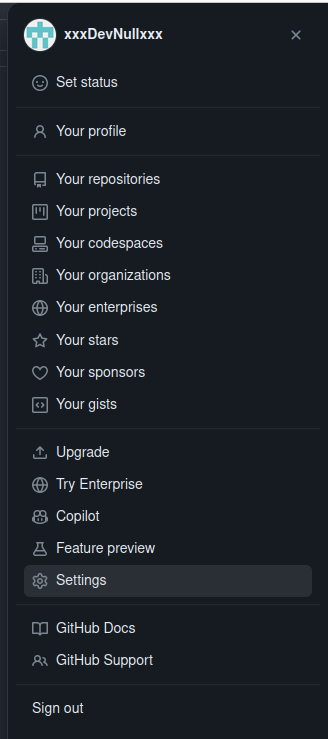
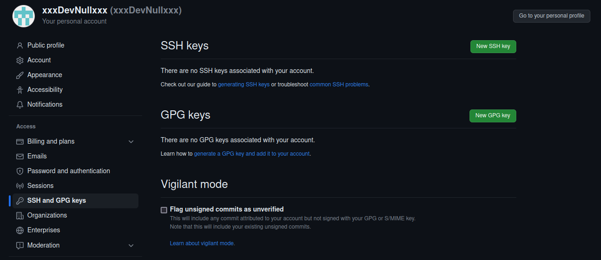
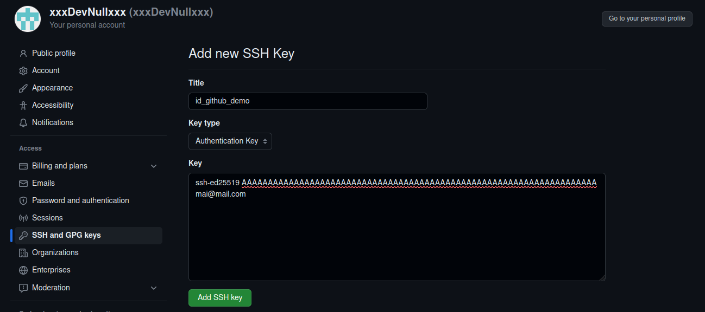

# Generating a new SSH key
Generiamo una coppia di chiavi ssh

```shell
ssh-keygen -t ed25519 -C "mia@mail.com" -f ~/.ssh/id_github_demo
```

Dopo il comando precedente avremo due file con chiave pubblica (.pub) e privata.

```shell
ls -l ~/.ssh/
```
```
.rw------- 444 oscar 27 Sep 17:52 id_github_demo
.rw-r--r--  94 oscar 27 Sep 17:52 id_github_demo.pub
```

# Modifichiamo il file di configurazione ~/.ssh/config 
Aggiungiamo le seguenti righe nel file ~/.ssh/config per indicare al client ssh di utilizzare le chiavi appena generate
quando contatta i server di github.com

```
Host github.com
       IdentityFile ~/.ssh/id_github_demo
```  

# Aggiungere la chiave pubblica all'elenco delle chiavi autorizzate sul proprio account guithub

Accedere alle impostazioni del proprio account

[](https://github.com/settings/keys)

Premere sul pulsante New SSH Key

[](https://github.com/settings/keys)

 Copiare il contenuto del file id_github_demo.pub nel campo Key 

[](https://github.com/settings/keys)

# Verifichiamo che tutto funzioni

```shell
ssh -T git@github.com
```

se tutto è andato bene dovremmo ottenere un messaggio simile a questo:

```
Hi CORSO01! You've successfully authenticated, but GitHub does not provide shell access.
```